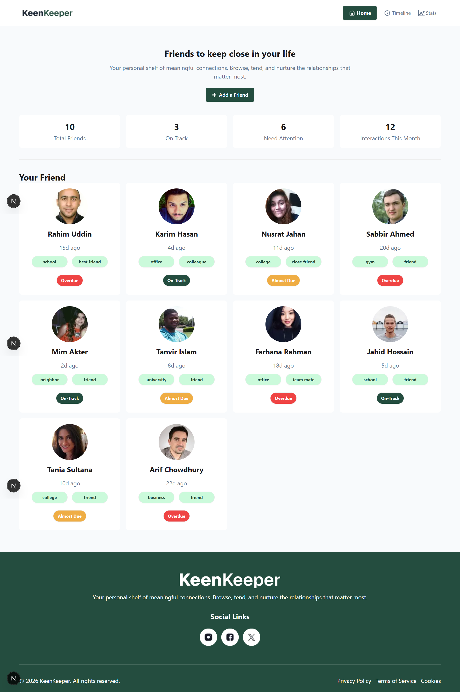

# 🌟 KeenKeeper

## 📌 Description

KeenKeeper is a modern relationship management web app that helps users keep track of their friends, interactions, and connection status. It allows users to organize meaningful relationships, monitor engagement frequency, and ensure no important connection is neglected.

---

## 🚀 Technologies Used

* ⚛️ React.js
* ⚡ Next.js
* 🎨 Tailwind CSS
* 📊 Recharts (for data visualization)
* 🔥 Context API (state management)

---

## ✨ Key Features

* 👥 **Friend Management System**
  Add, categorize, and track your friends with tags like *school, office, gym, etc.*

* 📈 **Interaction Tracking Dashboard**
  View stats such as total friends, on-track relationships, and pending interactions.

* 🔔 **Smart Status Indicators**
  Easily identify which connections need attention, are overdue, or are on track.

---

## 📷 UI Preview

A clean and responsive dashboard displaying:

* Friend cards with profile, tags, and last interaction time
* Summary stats (Total Friends, On Track, Need Attention, Interactions)
* Status badges (On Track, Overdue, Almost Due)

  

---

## 💡 Purpose

This project helps users maintain strong personal and professional relationships by visualizing and managing social interactions efficiently.

---

## 🛠️ Future Improvements

* Authentication system
* Notifications & reminders
* Mobile app version
* Advanced analytics

---

## 📬 Contact

Feel free to connect and give feedback!
